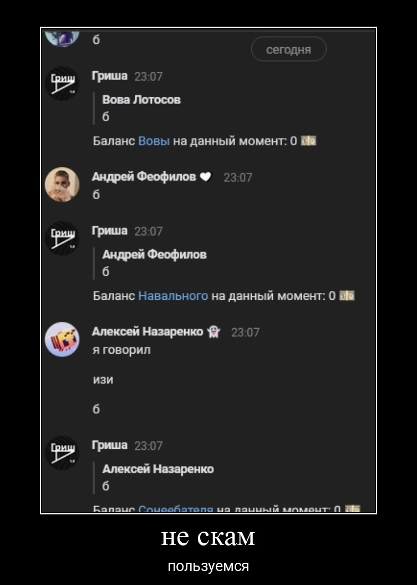

# Гриша Бот

Бот создан для того чтобы разбавить общение в беседах, имеет множетво функций:

- [Казино](/modules/casino.py)
- [Возможность установки кастомных имён](/modules/custom_names.py)
- [Обзывалки](/modules/insults.py)
- [Рп команды](/modules/rp.py)
- [Выбор человека дня](/modules/person_of_day.py)
- [Возможность обмениваться деньгами казино](/modules/balance.py)

## Гайд по установке
1. Установить зависимости (`pip install -r requirements.txt`)
2. Скопировать файл `.env.example` в `.env`
3. Заполнить енв
4. `aerich upgrade`
5. Запустить командой `python3 -m src`

Бот написан на [vkbottle 4.2](https://github.com/vkbottle/vkbottle/tree/v4.x), Python 3.10

Для склонения кастомных имён используется библиотека [PyMorphy2 0.9.1](https://github.com/kmike/pymorphy2/releases/tag/0.9.1)

